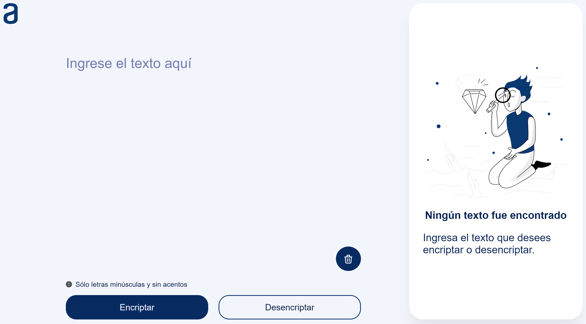

## Encriptador de texto

Proyecto realizado para ser presentado ante la entidad de [Alura Latam](https://www.aluracursos.com/?gad_source=1&gclid=Cj0KCQiAxOauBhCaARIsAEbUSQQjw_J9thy7ektyJWoObnNE-lka4H-GeGCXw-tyc1JzzBtz0tqL0yEaAgdAEALw_wcB).

### Descripción del programa
Este encriptador _**«codifica»**_ palabras o frases ingresadas por el usuario las cuales pueden ser _**«decodificadas»**_ nuevamente a su lenguaje original copiando el texto (que el propio programa codificó) y pegándolo en la sección _"Ingrese el texto aquí"_.

### ¿Cómo utilizar el encriptador de texto?

#### Para encriptar texto:
1. Haga un clic donde lo indica el sitio con la frase _"Ingrese el texto aquí"_.
2. Ingrese la palabra o palabras que desee _«codificar»_. Solo puede ingresar palabras con letras minúsculas y caracteres de espaciado (no se admiten caracteres especiales como acentos, símbolos o letras mayúsculas).
3. Haga un clic en el botón **Encriptar** y obtendrá el texto _*encriptado*_ en el recuadro derecho o inferior de la pantalla (según esté utilizando un pc de escritorio, pc portatil, tablet o teléfono móvil).

#### Para desencriptar texto:
Si desea _desencriptar_ la palabra o palabras que ingreso enteriormente siga los siguientes pasos:

1. Haga un clic en el botón **Copiar** y repita el paso Nro 1 indicado para encriptar texto.
2. Pege el texto copiado (puede hacerlo presionando Ctrl+V en el teclado o presione el botón derecho del mouse y elija la opción Pegar).
3. Haga un clic en el botón **Desencriptar** y obtendrá el texto _*desencriptado*_ (original) en la parte que le indica el paso Nro 3 para encriptar texto.

NOTA: También puede _desencriptar_ una palabra o palabras que hayan sido encriptada por otra persona (en otro dispositivo) y hubiese utilizado el mismo programa para encriptar texto. Para ello, repita los pasos Nro 2 y Nro 3 indicados para desencriptar texto.

### ¡Espero disfrute encriptando y desencriptando textos!

© HernanGoldy - 2024